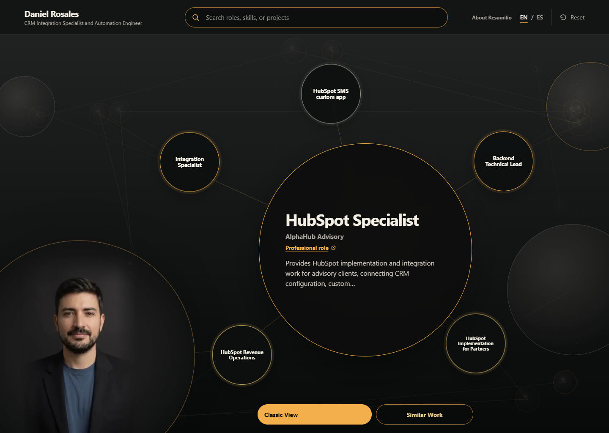

# Resumilio

[](https://github.com/danox46/resumilio/actions/workflows/ci.yml) [](https://www.npmjs.com/package/resumilio) [](LICENSE)

**A living, visual resume that connects your work, proof, and possibilities.**

[Explore the live profile](https://resumilio.danienremoto.com) · [See how it works](https://resumilio.danienremoto.com/how-to/) · [Versión en español](https://resumilio.danienremoto.com/es/acerca/)



Resumilio keeps one evidence-backed career record and presents it in two useful ways: an interactive constellation for discovery and a classic resume for applications. Recommendations react to what a visitor explores and explain the connection. The complete experience remains useful without JavaScript, a model key, a proprietary account, analytics, or a hosted database.

## Start locally

```sh
npm install -g resumilio@0.8.0
resumilio init my-profile
cd my-profile
resumilio validate
resumilio preview
resumilio export --format markdown
resumilio deploy
```

`deploy` creates sanitized local static artifacts. It never publishes them or asks for credentials.

| Command | What you get |
| --- | --- |
| `init` | A valid bilingual starter profile and guidance matched to your experience level. |
| `ingest` | A validated profile import or evidence-backed claim bundle. |
| `validate` | Schema, graph, lifecycle, evidence, and constellation-health checks. |
| `preview` | A local browser-ready profile. |
| `export` | JSON, Markdown, or HTML output from the same source. |
| `doctor` | A no-key runtime and profile health check. |
| `deploy` | Sanitized static deployment artifacts, without publishing. |

## Work with agents through MCP

```sh
npm install resumilio@0.8.0
npx resumilio init .
npx resumilio-mcp --profile ./resumilio.json
```

The local stdio MCP server exposes bounded tools to read and update claims, connect public sources, validate the graph, preview the experience, and build deployment artifacts. Agents help maintain the record; they do not become its owner. See [the MCP guide](docs/mcp.md).

## One public contract

The profile, classic resume, and machine interfaces share the versioned v1 schema. Claims keep lifecycle, provenance, evidence strength, and relationships distinct. Public discovery is available through `/.well-known/resumilio.json`, localized resume/evidence/graph/search exports, `llms.txt`, and crawlable pages.

The repository includes a generic starter and Daniel's deliberately sanitized public demonstration profile. It is not a private resume archive. Resumilio is open source—not a freemium shell: profile authoring, validation, search, export, the visual experience, and the local agent workflow are included under the MIT license. The name and marks are covered separately by [TRADEMARKS.md](TRADEMARKS.md).

## Develop and verify

```sh
npm ci
npm run phase6
npm run verify:browser-quality
npm pack --dry-run
```

Phase 6 builds the package and bilingual site, type-checks them, validates the public profile, exercises authoring and machine contracts, scans current files and history for private data, and enforces Lighthouse scores of at least 95. Browser QA covers keyboard use, reduced motion, no-JavaScript access, responsive layouts from 240px upward, the constellation carousel, and the classic resume.

Read [Architecture](docs/architecture.md), [How deployment works](docs/deployment.md), [Quality assurance](docs/quality-assurance.md), [Contributing](CONTRIBUTING.md), and [Security](SECURITY.md).
